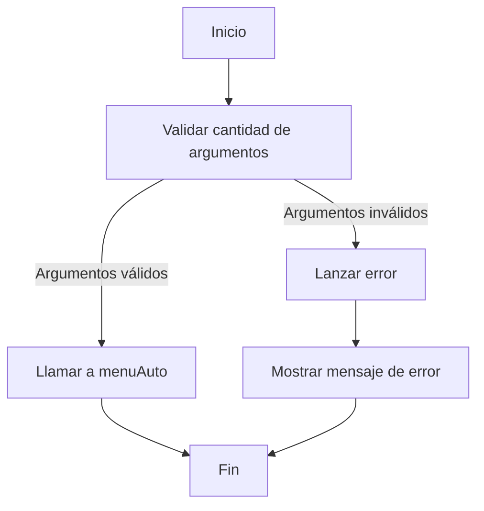
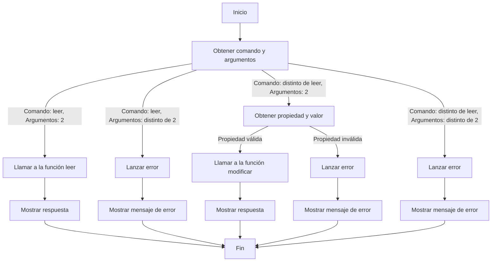

## Javascript FullStack Web Development
### Módulo 6, Sesión 5 - CICLO DE VIDA DE NODE Y PERSISTENCIA

# REBOUND EXERCISE: DESCRIBE AUTO

### EJERCICIO

Dada la siguiente información inicial, en el formato json:

```JSON
{  
    "ferrari": { 
        "modelo": "F40", 
        "asientos": 2 
    }, 
 
    "porsche": { 
        "modelo": "911", 
        "asientos": 2 
    }, 
 
    "lamborghini": { 
        "modelo": "murcielago", 
        "asientos": 2 
    } 
}
```
- Crea  un  programa  para  modificar  estos  datos,  utilizando  el  módulo  `fs`.  Como  primer  argumento en la línea de comandos, debes pasar el nombre del auto que se modificará, para así acceder a sus propiedades.
- Crea una opción para leer el archivo completo, y otra para solo leer las características de un auto en particular.  
- Realiza  las  validaciones  correspondientes,  para  que  así  tu  programa  tome  el  camino  correcto de ejecución, dependiendo de los argumentos ingresados.

En resumen, tu programa podrá ser ejecutado de las siguientes tres formas: 
- Para añadir o modificar propiedades: 
    ```
    node autos.js ferrari puertas 3. 
    ```
- Para leer el archivo completo:
    ```
    node autos.js leer
    ``` 
- Para leer solo las características de un auto en particular:
    ```
    node autos.js leer porsche.
    ```
### SOLUCIÓN - DISEÑO

#### 1. Validar cantidad de argumentos ingresados en CLI



#### 2. Validar contenido de los argumentos


#### 3. Lectura de datos
```mermaid
graph TD
    A[Inicio] --> B[Leer archivo de texto JSON]
    B --> C[Parsear datos JSON]
    C -- ¿Se proporcionó un nombre de automóvil? --> D[Devolver información de todos los autos registrados]
    D --> E[Fin]
    C -- ¿El nombre de automóvil existe en los datos? --> F[Devolver características del automóvil específico]
    F --> E[Fin]
    C -- El nombre de automóvil no existe --> G[Devolver "Auto no registrado"]
    G --> E[Fin]
    B -- Error al leer el archivo --> H[Lanzar error y mostrar mensaje de error]
    H --> E[Fin]
```

#### 4. Modificación de archivos
```mermaid
graph TD
    A[Inicio] --> B[Leer archivo de texto JSON]
    B --> C[Parsear datos JSON]
    C -- ¿El nombre de automóvil existe en los datos? --> D[Modificar valor de la propiedad]
    D --> E[Guardar cambios en el archivo]
    E --> F[Devolver "Datos actualizados con éxito"]
    C -- El nombre de automóvil no existe --> G[Devolver "Auto no registrado"]
    G --> F[Fin]
    B -- Error al leer o escribir en el archivo --> H[Lanzar error y mostrar mensaje de error]
    H --> F[Fin]

```